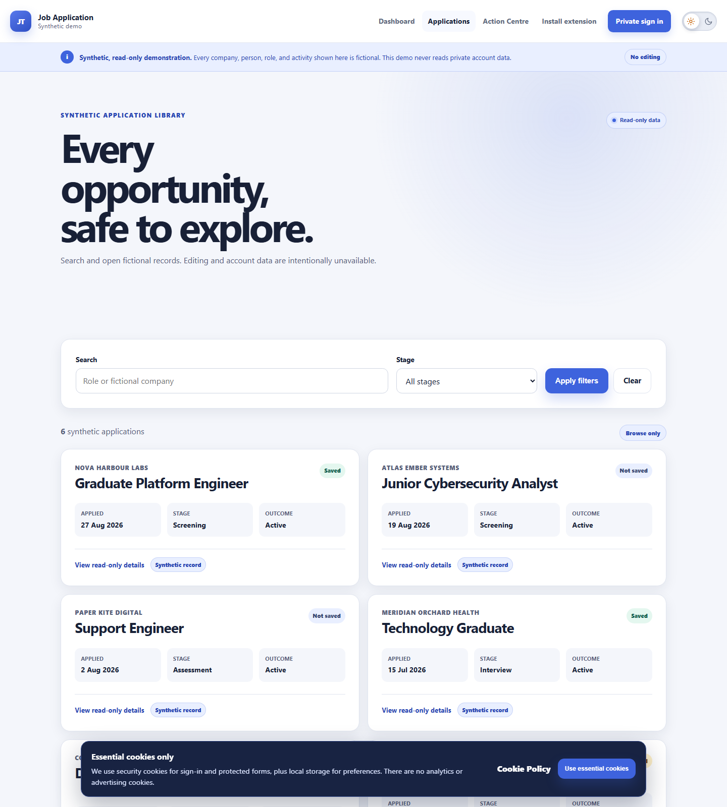
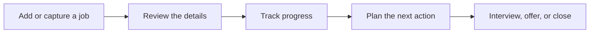
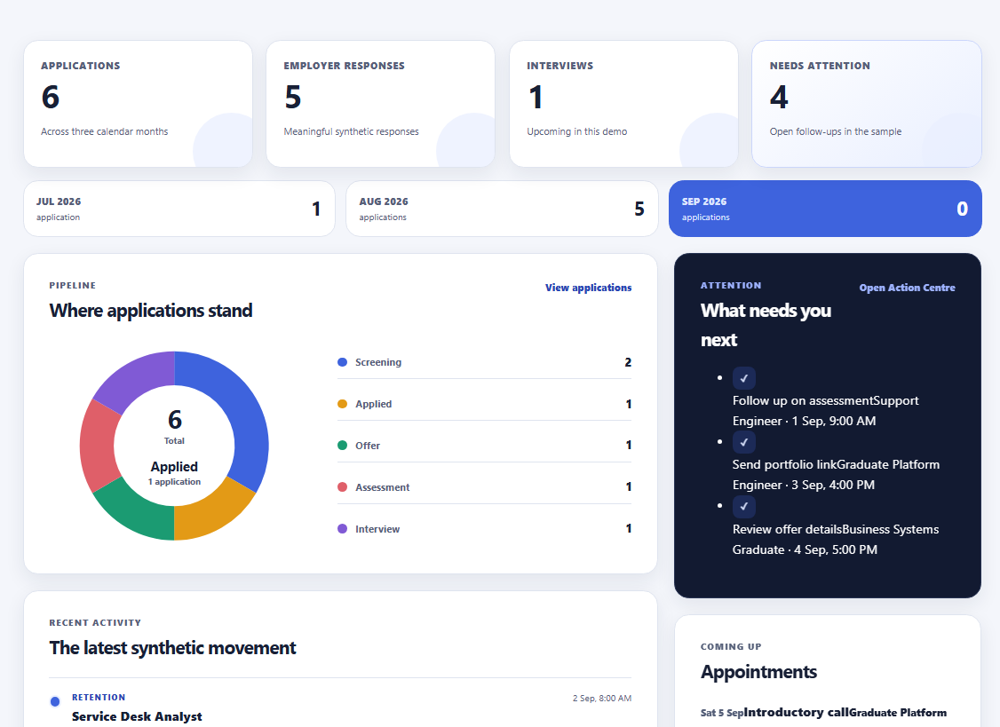
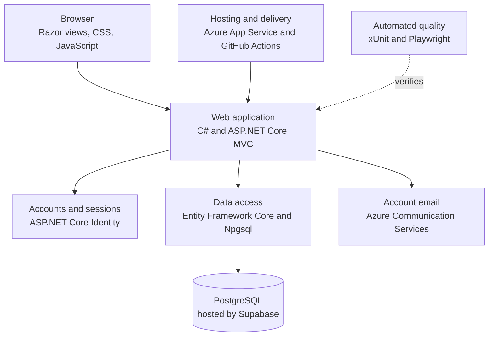

# Job Application Tracker

A full-stack web application that helps job seekers keep applications, follow-ups, interviews, and important dates in one private workspace.

I built this project to solve a problem I experienced during a real job search: useful details were spread across job boards, emails, notes, and calendar reminders. The tracker brings that work together without hiding decisions behind automation.

**[Explore the live demo](https://myjobtracker.com.au/demo)** · **[Visit the live site](https://myjobtracker.com.au)** · **[Create an account](https://myjobtracker.com.au/account/register)**



The public demo is read-only and uses fictional companies, people, and activity. It never reads private account data.

## Try it in two minutes

1. Open the [public demo](https://myjobtracker.com.au/demo). No account is needed.
2. Choose **Applications** to browse the fictional opportunities.
3. Open an application to see its timeline, notes, tasks, contacts, and appointments.
4. Visit the **Action Centre** to see follow-ups and upcoming work gathered in one place.
5. Use **Private sign in** if you want to create your own account and try the editable workflow.

## What the application does

- Adds applications manually or from pasted job advertisements.
- Imports public job pages into a review screen before anything is saved.
- Captures the job currently open in Chrome or Edge through an optional extension.
- Tracks stages, outcomes, contacts, conversations, tasks, and appointments.
- Highlights overdue follow-ups, interviews, and applications that may need attention.
- Protects saved applications and gives clear warning before old unsaved records are removed.
- Keeps every account's records separate and private.



## A quick look

### A dashboard built around the next useful action

The dashboard shows recent applications, employer responses, interviews, overdue tasks, and upcoming appointments without turning the search into a wall of statistics.



### One place for every opportunity

Applications can be searched and filtered by company, stage, outcome, date, saved state, and deletion status. Each application keeps its own history and supporting details.

### A browser extension that still keeps the user in control

The extension reads the active job advertisement only after it is clicked. It opens an editable review draft, so captured information can be checked before it becomes an application.


## Technology stack



| Area | Technology | Why it is here |
|---|---|---|
| User interface | Razor Views, responsive CSS, and focused JavaScript | Fast pages with accessible forms and very little browser-side complexity |
| Application | .NET 10, C#, and ASP.NET Core MVC | Clear server-side workflows, validation, and routing |
| Accounts | ASP.NET Core Identity | Registration, email verification, password recovery, and secure sessions |
| Data | Entity Framework Core, Npgsql, and PostgreSQL | Relational storage with migrations and account ownership enforced in the data model |
| Database hosting | Supabase PostgreSQL | Managed production database; authentication remains inside the application |
| Email | Azure Communication Services Email | Verification and password-reset messages |
| Delivery | GitHub Actions and Azure App Service | Repeatable checks and production hosting |
| Testing | xUnit and Playwright for .NET | Unit, integration, security, and real-browser coverage |

## Engineering decisions I care about

**Review before save.** Imports suggest fields and explain where they came from. Uncertain information stays blank for the user to decide.

**Privacy by design.** Private records are tied to their owner throughout the application and database relationships. The public demo uses a separate in-memory fictional catalog.

**Safe URL handling.** The importer accepts public web pages while blocking private networks, unsafe redirects, forwarded credentials, and oversized responses.

**Predictable extraction.** Pasted text, page metadata, and browser captures use deterministic rules. Job content is not sent to an AI service.

**Visible retention.** Old unsaved applications receive a warning period. Saving an application protects it, and no settings change silently deletes a record.

**Production-minded quality.** Pull requests verify formatting, locked dependencies, release builds, package vulnerabilities, automated tests, browser journeys, and publish output.

## Run it locally

You need the [.NET 10 SDK](https://dotnet.microsoft.com/download/dotnet/10.0), Git, and a PostgreSQL database.

1. Clone the repository and enter the project folder.

   ```powershell
   git clone https://github.com/Chit-Thway/job-application-tracker.git
   cd job-application-tracker
   ```

2. Store your PostgreSQL connection string outside the repository.

   ```powershell
   dotnet user-secrets set "ConnectionStrings:DefaultConnection" "Host=localhost;Database=jobtracker;Username=postgres;Password=your-password" --project src/JobTracker.Web
   ```

3. Prepare the database.

   ```powershell
   dotnet tool restore
   dotnet ef database update --project src/JobTracker.Web
   ```

4. Start the application.

   ```powershell
   dotnet run --project src/JobTracker.Web --launch-profile http
   ```

5. Open [http://localhost:5261](http://localhost:5261).

The application shows local verification emails at `/dev/mail` while running in Development, so local registration does not require an email provider.

## Install the browser extension locally

1. Start the tracker and sign in.
2. Open `chrome://extensions` in Chrome or `edge://extensions` in Edge.
3. Turn on **Developer mode**.
4. Choose **Load unpacked** and select the `browser-extension` folder.
5. Pin **Job Application Tracker Capture** to the toolbar.
6. Open a job advertisement and choose **Capture this tab and review**.

The published extension is also available through the [Chrome Web Store](https://chromewebstore.google.com/detail/ofeagkadonbdgjhdiobfdnmafhoknkig). Its focused guide is in [browser-extension/README.md](browser-extension/README.md).

## Project structure

```text
browser-extension/   Chrome and Edge active-tab capture extension
database/            Production database scheduling scripts
docs/                Security, accessibility, deployment, and operations guides
scripts/             Small maintenance and verification tools
src/JobTracker.Web/  The web application
tests/                Unit, integration, and real-browser tests
```

## Quality checks

Run the same main checks used by continuous integration:

```powershell
dotnet restore --locked-mode
dotnet format --verify-no-changes --no-restore
dotnet build --configuration Release --no-restore
dotnet test --configuration Release --no-build
```

The current suite covers application workflows, account boundaries, retention, imports, security rules, the public demo, and critical journeys in Chromium.

## More detail

- [Security and privacy review](docs/security-review.md)
- [Accessibility review](docs/accessibility.md)
- [Testing approach](docs/test-strategy.md)
- [Azure deployment guide](docs/azure-deployment.md)
- [Operations guide](docs/operations.md)
- [Backup and restore guide](docs/backup-restore.md)

Built by Chit-Thway as a practical, production-hosted response to the everyday work of managing a job search.
