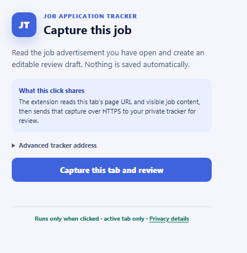
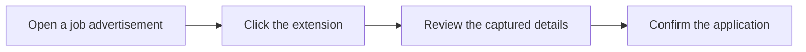

# Job Application Tracker Capture

A small Chrome and Edge extension that turns the job advertisement in your active tab into an editable Job Application Tracker draft.

It is designed to save repetitive copying while keeping the final decision with the user.

**[Install from the Chrome Web Store](https://chromewebstore.google.com/detail/ofeagkadonbdgjhdiobfdnmafhoknkig)** · **[Open Job Application Tracker](https://myjobtracker.com.au)**

## How to use it

1. Sign in to [Job Application Tracker](https://myjobtracker.com.au/account/login).
2. Open a public job advertisement in Chrome or Edge.
3. Click **Job Application Tracker Capture** in the browser toolbar.
4. Choose **Capture this tab and review**.
5. Check the title, company, location, salary, closing date, and description in the review draft.
6. Correct anything that needs attention, then confirm the application.

If the tracker asks you to sign in, return to the job advertisement after signing in and click the extension again.

## What it can capture

- Job title and company
- Location and workplace arrangement
- Employment type and advertised pay
- Job reference and closing date
- Readable job description
- The original job-page address

The page reader understands official `JobPosting` information and has focused support for SEEK, Indeed, LinkedIn, Prosple, and Greenhouse layouts. When a field is unclear, the review screen leaves room for the user to correct it.

## Privacy in plain language

- The extension runs only after the user clicks it.
- It reads only the active tab at that moment.
- It sends the page address and visible job information to the user's chosen tracker over HTTPS.
- It creates a temporary review draft rather than saving an application immediately.
- A pending handoff is encrypted, single-use, and expires after ten minutes.
- The extension has no advertising, analytics, background page reader, remote AI call, or broad access to browsing history.

Chrome lists three permissions:

| Permission | Why it is needed |
|---|---|
| `activeTab` | Temporarily read the page where the user clicked the extension |
| `scripting` | Run the capture after that click |
| `storage` | Remember the tracker address and hold the capture while the review tab opens |

Read the public [extension privacy page](https://myjobtracker.com.au/extension/privacy) for the full explanation.

## Install it from this repository

This option is useful when reviewing or developing the project.

1. Start Job Application Tracker and sign in.
2. Open `chrome://extensions` in Chrome or `edge://extensions` in Edge.
3. Turn on **Developer mode**.
4. Choose **Load unpacked**.
5. Select this `browser-extension` folder.
6. Pin **Job Application Tracker Capture** to the toolbar.

After pulling an extension update, select **Reload** on the browser's extension page before testing an already-open job tab.

The extension uses [myjobtracker.com.au](https://myjobtracker.com.au) by default. **Advanced tracker address** in the popup can point it to a local development address when needed.

Return to the [main project README](../README.md) for the product overview, technology stack, and local application setup.
